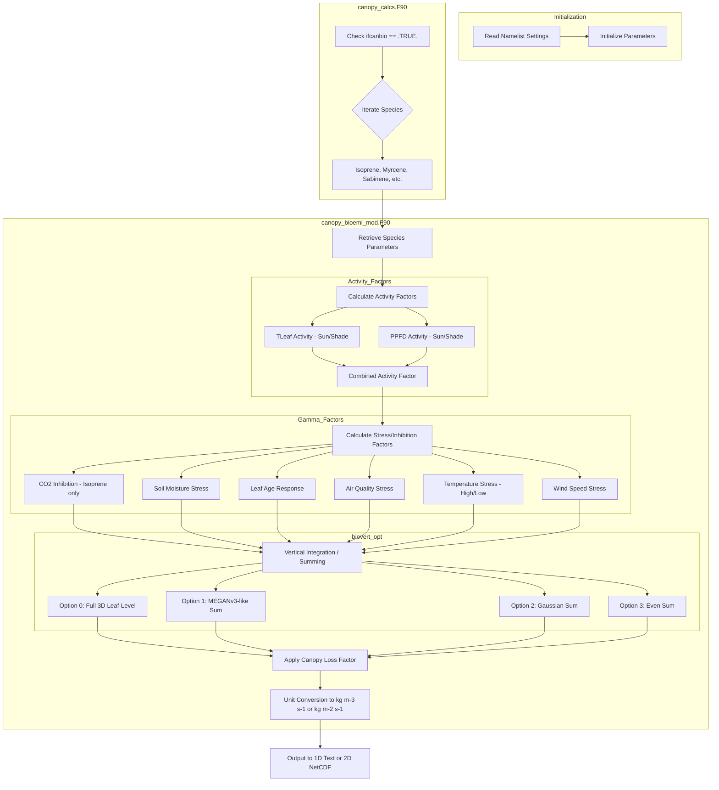

# Biogenic Emissions Workflow

This document describes the workflow for calculating biogenic emissions in Canopy-App.

## Detailed Steps

1.  **Parameter Retrieval**: The `canopy_biop` subroutine in `canopy_bioparm_mod.F90` provides emission factors (EF) and algorithm coefficients (LDF, Beta, etc.) based on MEGAN2.1.
2.  **Activity Factors**: Leaf-level activity depends on leaf temperature (TLeaf) and photosynthetically active radiation (PPFD) for both sunlit and shaded fractions.
3.  **Stress Factors**: Gamma factors account for environmental stresses including soil moisture, leaf age, ozone exposure (W126), and extreme meteorological conditions.
4.  **Vertical Integration**: Depending on `biovert_opt`, emissions are either kept at the leaf level throughout the canopy profile or integrated into a total flux.
5.  **Loss Factor**: A canopy loss factor is applied when summing emissions to account for in-canopy processing.
6.  **Conversion**: Final emissions are converted from $\mu g/m^2/hr$ to model units ($kg/m^3/s$ or $kg/m^2/s$).
